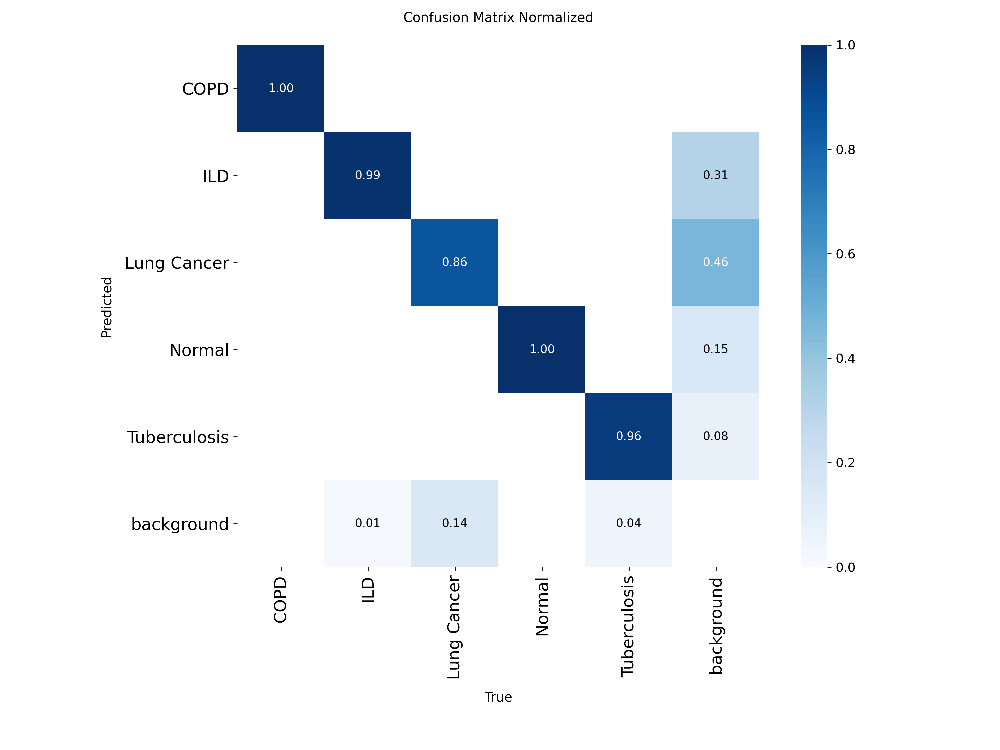
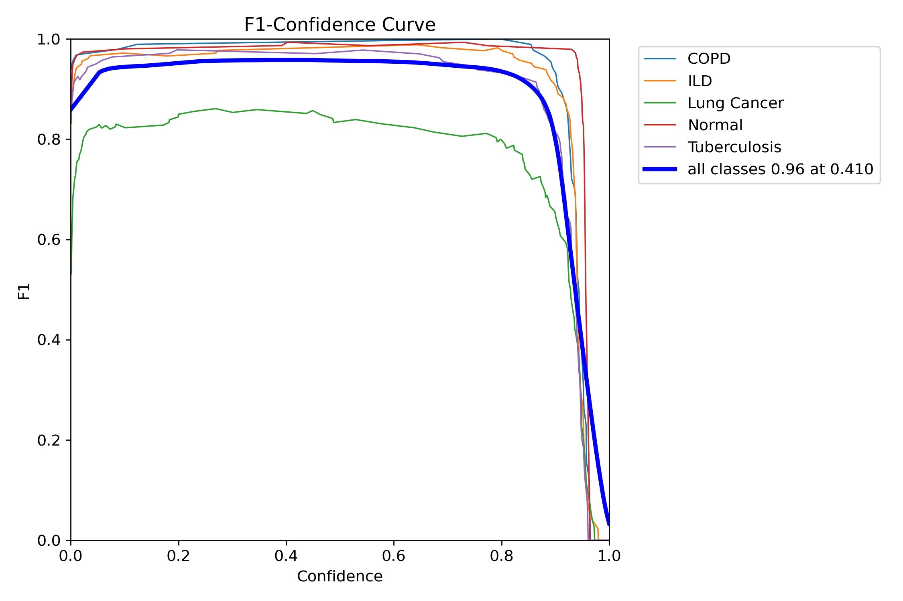
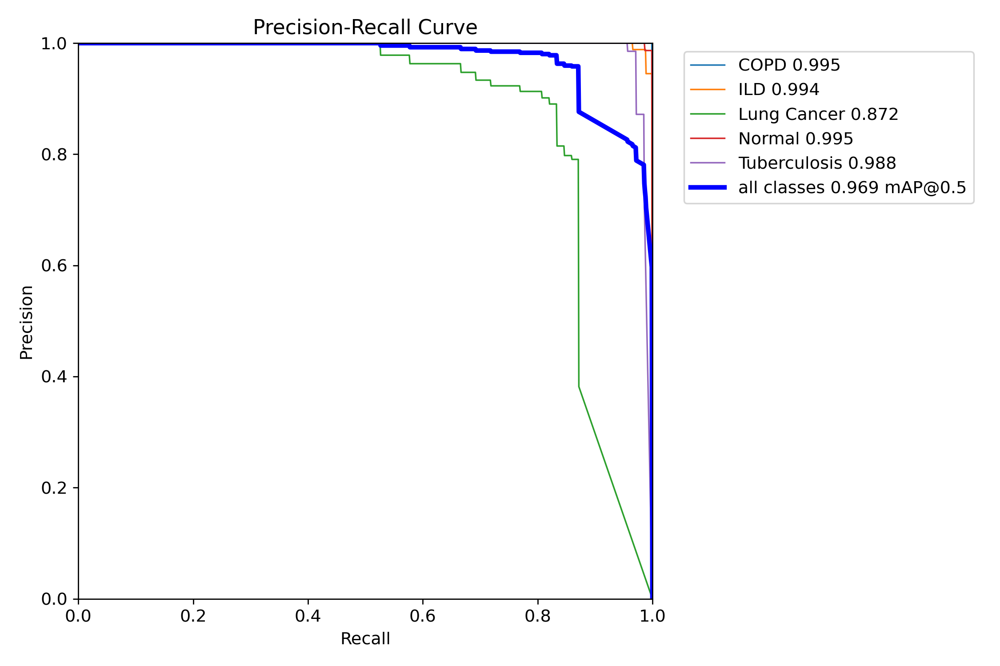
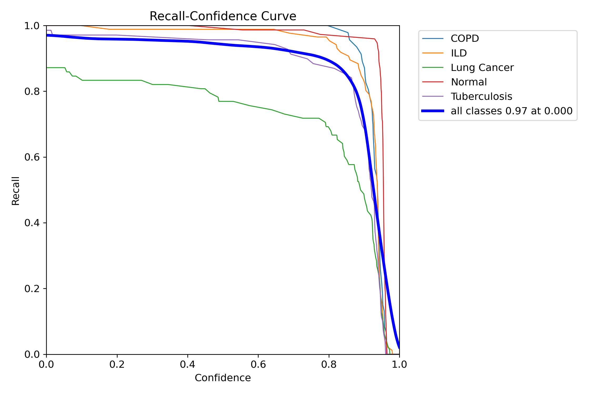

# Kitahack 2026
## Project Name: Med Vision
### Group name: abc
### Team Members: Joseph Lau Tiew Jung
____
## Overview
An AI-driven triage and reporting system designed for Malaysian clinics that lack on-site professional radiologists. This solution automates X-ray analysis, evaluates critical levels, and generates editable medical reports to reduce patient bottlenecks and assist medical staff.

**SDG Alignment:** SDG 3: Good Health and Well-being

## Problem statement 
Malaysian clinics frequently lack on-site professional radiologists, creating patient bottlenecks and delaying the triage of critical cases like tumors. Radiologists report that they faced unbearable workload and unmanageable patient counts. Citizens live in the rural area report that they don't have access to a professional radiologist after they got their CT scan  from technicians. With only 870 registered radiologists catering to a population of 33.57 million, the ratio is 3.9 per 100000 individuals. (National Library of Medicine). Approximately 75% of Malaysia's population lives in urban areas, where 80% of radiological services are private. Trainees and non-radiologists have a 69% accuracy rate in interpreting plain radiographs, raising quality concerns. (Ramli N, Academia.edu)

## Features
* **Automated X-Ray Analysis:** YOLO detects and highlights potential tumors.
* **Smart Triage & Reporting:** The Gemini API acts as an AI radiologist, evaluating visual data and text reports to classify criticality (Low/Medium/High) and generating editable, downloadable summaries.
* **Emergency Routing:** Integrates the Google Maps API to immediately locate and route high-risk patients to the nearest specialist hospital.
* **Secure Storage:** Firebase manages the secure storage and retrieval of patient X-rays and reports.

## Tech Stack
* **Frontend:** React.js
* **Backend:** Spring Boot (Core logic/Routing), FastAPI (AI/Model serving)
* **AI Models:** Gemini API (Text/Context analysis), YOLO (Tumor detection)
* **API Services** Google Map API (Find relevant specialist), Firebase authentication (user registration and login)
* **Database** FireStore (store user information)

## Technical Architecture & Implementation
* The system utilizes a microservices architecture. The React frontend securely uploads X-rays to Firebase. 
* The FastAPI backend handles the YOLO object detection and constructs a JSON payload containing bounding boxes and patient data. This payload is sent to the Gemini API for final evaluation and report generation. 
* Spring Boot handles most of the business logic, such as ring user data, sending data to python backend server side for AI operations.

## Innovation
* **Innovation:** Combining computer vision (YOLO) with LLM reasoning (Gemini) to create a comprehensive, context-aware medical evaluation pipeline, bridging the gap between basic clinics and specialized care. YOLO is used because it is extremely light-weight and fast, which save the compute resources for GEMINI LLM complex agentic workflow.
* Integrating asynchronous Python-based AI microservices (FastAPI) with a robust Java backend (Spring Boot) while ensuring low-latency responses for real-time clinic use. Resolved by establishing strict JSON contracts and optimizing API calls.

## Project Structure 
```
med-vision/
├── frontend/ (user interface)
│   ├── src/
│   ├── public/
│   └── package.json
├── PythonBackend/ (ai agents and yolo object recognition)
│   ├── app/
│   ├── models/
│   └── requirements.txt
├── SpringBootBackend/ (core backend business logic, e.g. user authentication, store user info, send data to PythonBackend)
│   ├── src/
│   └── pom.xml
└── README.md
```

## Architecture Diagram 

## Setup Instructions
This setup instructions is for those who are using windows command prompt. For the Mac and Linux users please search for the instructions online.
### Prerequisites
* Node.js & npm
* Python 3.9+
* Java 17+ & Maven
* API Keys: Gemini API, Google Maps API, Firebase Configuration

### 1. Setup API Key 
1. Navigate to frontend/.env VITE_GOOGLE_MAP_API_KEY={YOUR_GOOGLE_MAP_API_KEY}
2. Navigate to PythonBackend/, paste your firebase configuration json file as config.json
3. In the same directory, create a .env file and paste your GEMINI_API_KEY={YOUR GEMINI API KEY}
4. Navigate to SpringBootBackend\src\main\resources, paste your firebase configuration json file as config.json 
### 2. Frontend (React)
```bash
cd frontend
npm install
npm run dev
```

### 3. AI Service (FastAPI)
```bash
cd PythonBackend
python -m venv venv # create a virtual environment  
.\venv\Scripts\activate # activate virtual environment
pip install -r requirements.txt
uvicorn app.main:app --reload
```
*(Ensure YOLO weights(best.pt) are placed in the `/models` directory)*

### 4. Core Backend (Spring Boot)
```bash
cd SpringBootBackend
mvn spring-boot:run # start with maven / mvnd if maven daemon
```
*(Configure your application.properties with the necessary Firebase and Google Maps credentials)*

### Datasets for the training of the YOLO model 
**google drive link** https://drive.google.com/drive/folders/1cK8WNZ4Yoa0kK7M21Zs6XDl_nXNyuvL-?usp=drive_link

### YOLO Model metrics 
* normalized confusion matrix 

* Box F1 curve 

* Box P curve 

* Box PR curve

* Box R curve 


### Future Suggestions
**Google Cloud Healthcare API Integration**
* Currently, the app is processing standard images (PNG/JPEG). To make this a true enterprise clinical solution, migrate to the Google Cloud Healthcare API. This API natively supports the DICOMweb standard (the global standard for medical imaging) and includes built-in tools for automated patient data de-identification, which is crucial for medical compliance.

**Active Learning Pipeline (Doctor-in-the-Loop)**
* Allow doctors to manually adjust or delete YOLO bounding boxes on the React frontend if the AI makes a mistake. Save these corrected coordinates back to Firestore to create a continuous fine-tuning loop for 
your YOLO model.

**Centralised Database with critical level notification system** 
* Allow the radiologist to batch upload patient’s CT scan. The CT scan is stored in a centralised high performance object storage such as AWS S3. The radiologists is alerted based on the critical level of the patient’s tumor
